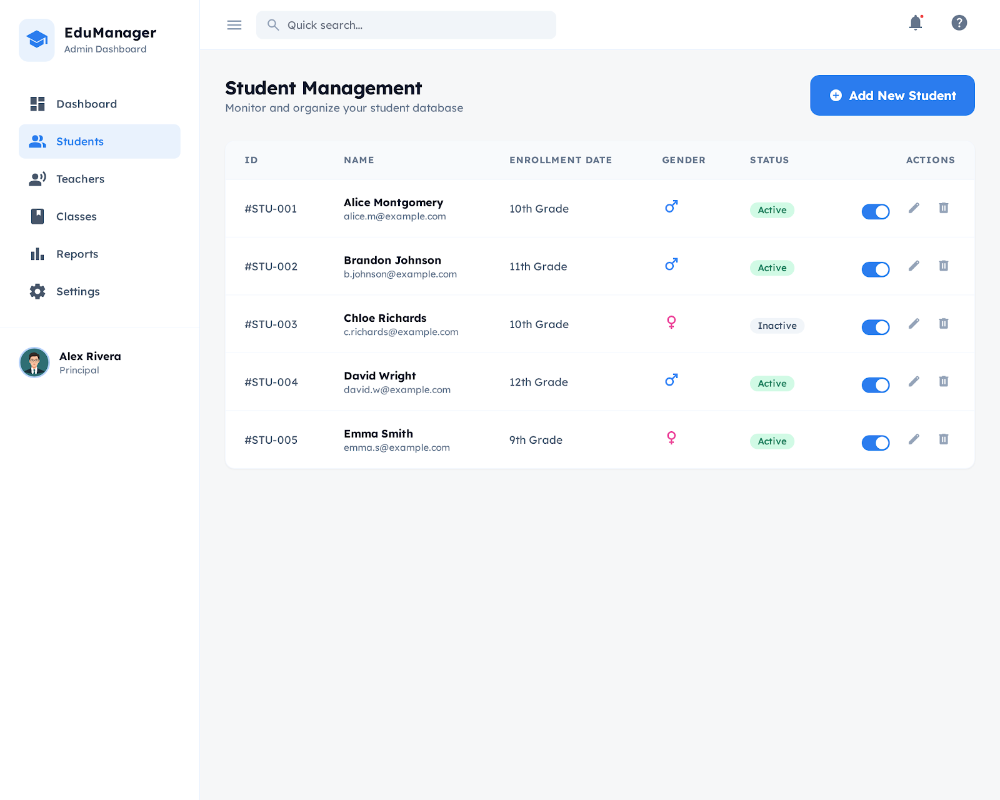

# Day 1 Exercise: Student List Display

## 1. Prerequisites

Prior to commencing this exercise, please ensure the following software is installed on your development machine.

### 1.1 NodeJS (Latest Stable Version)

NodeJS is a JavaScript runtime built on Chrome's V8 engine, enabling JavaScript to run on the server-side.

**Installation Guide:**

1. Visit the official NodeJS website at https://nodejs.org/
2. Download the LTS (Long Term Support) version for your operating system
3. Run the installer and follow the on-screen instructions
4. Verify installation by running `node --version` in your terminal

### 1.2 NPM (Node Package Manager)

NPM is the default package manager for NodeJS and comes bundled with NodeJS installation.

**Verification:**
Run `npm --version` in your terminal to confirm installation.

### 1.3 Git

Git is a distributed version control system for tracking changes in source code during software development.

**Installation Guide:**

1. Visit https://git-scm.com/
2. Download the installer for your operating system
3. Run the installer with default settings
4. Verify installation by running `git --version` in your terminal

### 1.4 IDE: Visual Studio Code

Visual Studio Code is a lightweight but powerful source code editor with built-in support for JavaScript, TypeScript, and React development.

**Installation Guide:**

1. Visit https://code.visualstudio.com/
2. Download the installer for your operating system
3. Run the installer and follow the on-screen instructions

---

## 2. Project Introduction

### Phase 1 Project: Student Management System

Throughout Phase 1, you will be building a **Student Management System** — a React application that enables users to perform CRUD (Create, Read, Update, Delete) operations on student records. This project serves as a foundation for understanding React development with TypeScript and prepares you for the more complex YOEDU Education Center Management system in Phase 2.

The project will progressively build upon each day's exercises, culminating in a fully functional student management application by the end of Phase 1.

---

## 3. Day 1 Exercise Specification

### Objective

Create a page to display a list of students.

### Requirements

1. Display a list of students retrieved from the local storage
2. Each student entry shall display the following information:
   - Student ID
   - Student Name
   - Email Address
   - Phone Number
   - Status (Active/Inactive)
3. The layout shall be responsive and visually appealing
4. The design shall align with the mock-up provided below

### Mock-up Design

Please refer to the following mock-up image for visual reference:



---

## 4. Project Structure

The project follows a structured organization to maintain clarity and scalability. Below is an overview of the directory structure:

```
/src
├── /components
│   └── /shared         # Shared components used throughout the application
├── /config             # Application configuration (routes, constants, etc.)
├── /layout             # Layout components for route wrapping
├── /mock               # Mock data for development and testing
├── /pages              # Page components representing routes
├── /services           # Data retrieval services (localStorage API for Phase 1)
└── ...
```

### Directory Descriptions

| Directory            | Description                                                                                                                                                                    |
| -------------------- | ------------------------------------------------------------------------------------------------------------------------------------------------------------------------------ |
| `/components/shared` | Contains reusable components such as buttons, cards, inputs, etc.                                                                                                              |
| `/config`            | Holds configuration files including route definitions. Rarely requires changes.                                                                                                |
| `/layout`            | Defines layout structures for different routes (e.g., dashboard layout, auth layout).                                                                                          |
| `/mock`              | Contains mock data files for development purposes.                                                                                                                             |
| `/pages`             | Contains page-level components representing each route in the application.                                                                                                     |
| `/services`          | Provides data access methods. For Phase 1, localStorage is utilized as the data persistence layer. Predefined API functions are available for use in completing this exercise. |

---

## 5. Technical Requirements

The following technical requirements must be adhered to:

1. **Component Type**: Use React functional components exclusively
2. **Styling**: Utilize Tailwind CSS for all styling
3. **Language**: Use TypeScript throughout the application
4. **Data Source**: Retrieve student data from localStorage using the provided service functions

---

## 6. Helpful VSCode Extensions

The following Visual Studio Code extensions are recommended to enhance your development experience:

| Extension                              | Description                                                                  | Marketplace Link                                                                          |
| -------------------------------------- | ---------------------------------------------------------------------------- | ----------------------------------------------------------------------------------------- |
| Code Spell Checker                     | Spelling checker for source code to catch typos                              | https://marketplace.visualstudio.com/items?itemName=streetsidesoftware.code-spell-checker |
| Colorize                               | Visualizes CSS colors in your code                                           | https://marketplace.visualstudio.com/items?itemName=kamikillerto.vscode-colorize          |
| ES7+ React/Redux/React-Native Snippets | Extensions for React, React-Native and Redux in JS/TS with ES7+ syntax       | https://marketplace.visualstudio.com/items?itemName=dsznajder.es7-react-js-snippets       |
| Prettier                               | Code formatter for consistent style                                          | https://marketplace.visualstudio.com/items?itemName=esbenp.prettier-vscode                |
| Tailwind CSS IntelliSense              | Intelligent Tailwind CSS tooling for VS Code                                 | https://marketplace.visualstudio.com/items?itemName=bradlc.vscode-tailwindcss             |
| vscode-icons                           | Adds icons to VSCode for better file visualization                           | https://marketplace.visualstudio.com/items?itemName=vscode-icons-team.vscode-icons        |
| GitLens — Git supercharged             | Visualize code authorship at a glance via Git blame annotations and CodeLens | https://marketplace.visualstudio.com/items?itemName=eamodio.gitlens                       |

---

## Summary

In this exercise, you shall:

1. Set up your development environment
2. Understand the project structure
3. Display a list of students on the dashboard page
4. Apply Tailwind CSS for styling
5. Use TypeScript for type safety

Good luck with your implementation!
